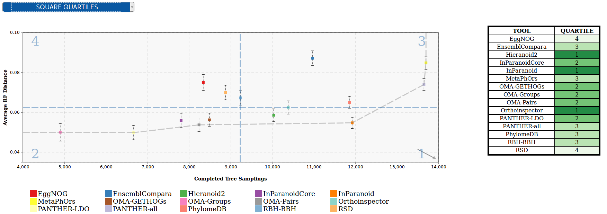

# OpenEBench Scientific Benchmarking visualizer
Repository that contains the code required to visualize results from scientific benchmarking experiments in plot format, and apply several classification methods in order to transform them to tabular format.

## Branches
* master: Python visualizer scripts 
* js: JavaScript visualizer project

## Classification methods
* Square quartiles - divide the plotting area in four squares by getting the 2nd quartile of the X and Y metrics.

* Diagonal quartiles - divide the plotting area with diagonal lines by assigning a score to each participant based in the distance to the 'optimal performance'.

* Clustering - group the participants using the K-means clustering algorithm and sort the clusters according to the performance.

## How to use

Requirements:

-npm
-http server

Clone the repo to your document root :
```
git clone https://github.com/inab/OpenEBench_scientific_visualizer.git
```

Install dependencies from package.json :
```
npm install 
```

Export node moodules :
```
export PATH="${PWD}/node_modules/.bin/:$PATH"
```
Compile with webpack and visualize sample results in your localhost :
```
./node_modules/.bin/webpack-cli src/app.js --output=build/build.js -d -w
```
## Live Demo
See a demo of how this visualizer works [here](https://inab.github.io/OpenEBench_scientific_visualizer/)


